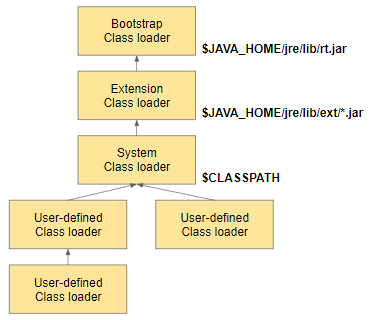

# JVM이 실행되는 과정

### JVM이란

- 자바 가상 머신으로 자바 바이트코드(.class 파일)를 OS에 특화된 코드로 변환하여 실행
- Java 애플리케이션은 JVM을 한 번 더 거칠뿐 아니라 하드웨어에 맞게 완전히 컴파일 된 상태가 아니라 실행 시에 해석(interpret)되기 때문에 속도가 느림

### 실행 과정

1. Java 소스를 작성
    - 확장자 .java
2. 바이트 코드로 변환
    - 자바 컴파일러 (javac)
    - 확장자 .class
3. 클래스 로더에 의해 JVM 메모리에 클래스 적재
    
    
    
    - Bootstrap 클래스 로더
        - JVM 시작 시 가장 최초로 실행되는 클래스 로더
    - Extension 클래스 로더
        - 확장 자바 클래스들을 로드
        - `java.ext.dirs` 환경 변수에 설정된 경로의 클래스를 로드
        - `${JAVA_HOME}/jre/lib/ext` 에 있는 클래스를 로드
    - System 클래스 로더
        - 자바 실행 시, 지정한 `classpath`에 있는 클래스, jar를 로드
        - 개발자가 작성한 .class 를 로드
    - 동작 방식
        - JVM의 Mehtod Area에 클래스를 찾고 있으면 사용
        - Mehtod Area에 없는 경우 `System`  → `Extension`  → `Bootstrap` 로 요청을 위임
        - 각 로더는 Classpath(JDK/JRE/LIB)에 해당 클래스를 찾고 없을 경우 `Bootstrap`  → `Extension`  → `System`  순서로 요청을 넘김
        - 만약 마지막까지 클래스를 찾지 못할 경우 `ClassNotFoundException` 발생
    - 동작 특징
        - 위임
            - 요청을 받았을 때, 상위 클래스 로더에게 책임을 위임
        - 가시 범위
            - 하위 클래스 로더만 상위 클래스가 로드한 클래스를 볼 수 있으며 반대 방향은 불가능
        - 유일성
            - 상위 클래스 로더가 로드한 클래스는 하위 클래스 로더에서 다시 로드하지 않음

---

[https://steady-coding.tistory.com/593](https://steady-coding.tistory.com/593)
[https://choicode.tistory.com/16](https://choicode.tistory.com/16)
[https://www.baeldung.com/java-classloaders](https://www.baeldung.com/java-classloaders)
[https://www.geeksforgeeks.org/classloader-in-java/](https://www.geeksforgeeks.org/classloader-in-java/)
[https://velog.io/@sgwon1996/JAVA의-동작-원리와-JVM-구조](https://velog.io/@sgwon1996/JAVA%EC%9D%98-%EB%8F%99%EC%9E%91-%EC%9B%90%EB%A6%AC%EC%99%80-JVM-%EA%B5%AC%EC%A1%B0)