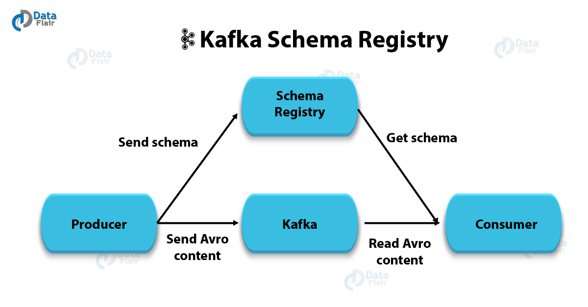
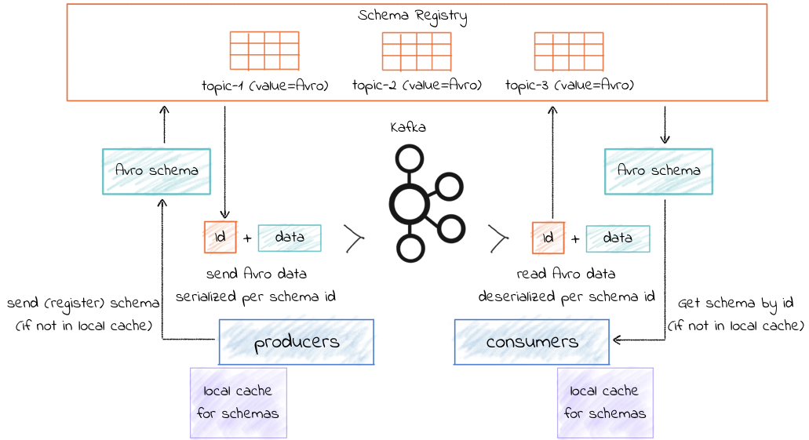

# 스키마 레지스트리

## 1. 스키마의 개념과 유용성

> 기존 관계형 데이터 베이스에서의 스키마

- 스키마가 미리 정의되어 있음
- 데이터를 추가하기 위해서는 반드시 사전에 정의되어 있어야 함
- 정의되어 있지 않은 스키마의 경우 데이터 추가를 시도하면 실패함

> 만약 관계형 데이터 베이스에서 스키마가 없다면?

- 데이터 형식에 대해 잘 알고 있으므로 스키마가 없어도 큰 문제가 없음
    - 관리자 A 혼자서 전체 데이터베이스에 대한 스키마를 관리한다고 가정
- 동일한 데이터베이스에 접속해 읽고 쓴다면 다른 형식의 데이터를 추가할 수 있음
    - 관리자 A 혼자가 아닌 다른 사용자도 같이 사용한다는 가정

###### 다른 형식의 데이터로 문자열 오류나 파싱 에러가 나면서 서비스 중지에 준하는 대형 장애로 이어질 수 있음

> 조금 더 카프카 구조와 업무적으로 접근하자

- 카프카의 쓰기 작업은 가장 말단에서 실행, 중간에 수정 작업을 할 수 없음
- 카프카는 중앙 데이터 파이프 라인 역할을 하며 수많은 사용자가 수많은 토픽을 이용
- 컨슈머는 어떤 프로듀서가 메세지 발행했는지 모르며 전적으로 프로듀서를 신뢰해야 함
    - 컨슘하는 사용자가 1명이면 설명하는 일이 어렵지 않음
    - 사용자가 많거나 자주 바뀐다면 그때마다 데이터 구조를 설명하는 일은 쉽지 않음
- 스키마 변경이 일어날 경우 담당자들에게 알려주려면 메일이나 문서로 공유가 매번 필요함
    - 만약 스키마 관리 기능이 없다면 매번 이벤트 처리하는 담당자와 사전 협의가 필요
- 수많은 데이터 엔지니어나 데이터 분석가들이 데이터 파싱으로 인해 시간을 낭비
    - 관련된 종사자들의 비용이 높아 손해가 큼

## 2. 카프카와 스키마 레지스트리

- 스키마 레지스트리라는 별도의 애플리케이션을 이용
- 2015년 2월 카프카 0.8.2 버전 출시와 함께 같이 공개
- 아파치 오픈소스가 아닌 컨플루언트 커뮤니티 라이선스, 비상업적인 용도에 한해 무료로 사용 가능

### 2.1. 스키마 레지스트리의 에이브로 지원



- 스키마 레지스트리는 카프카와 별도로 구성된 독립적인 애플리케이션
- 스키마 레지스트리와 프로듀서, 컨슈머와 직접 통신
- 스키마 레지스트리는 프로듀서에 의해 등록된 스키마 정보를 카프카 내부 토픽에 저장
- 프로듀서는 스키마 ID와 메세지를 카프카로 전송, 컨슈머는 스키마 ID를 스키마 레지스트리로부터 읽고 메시지와 조합
- 스키마 레지스트리는 대표적으로 에이브로 포맷을 지원

### 2.2. 스키마 레지스트리의 에이브로 지원

- 에이브로는 시스템, 프로그래밍 언어, 프로세싱 프레임워크 사이에서 데이터 교환을 도와주는 오픈소스 직렬화 시스템
- 에이브로는 아파치 하둡 프로젝트에서 처음 시작되었음
- 스키마 레지스트리는 에이브로 포맷을 가장 먼저 지원, 후에 JSON, 프로토콜 버퍼 포맷도 지원
- 컴플루언트는 다음과 같은 이유로 에이브로 포맷 사용을 권장
    - JSON과 매핑
    - 매우 간결한 데이터 포맷
    - 바이너리 형태이므로 빠름

```json
{
  "namespace": "test.avro",
  "type": "record",
  "doc": "example of Avro",
  "name": "Test",
  "fields": [
    {
      "name": "name",
      "type": "string",
      "doc": "name"
    },
    {
      "name": "class",
      "type": "int",
      "doc": "class"
    }
  ]
}
```

- 자세한 설명은 아래의 링크를 참고
    - [스키마 정의](https://docs.confluent.io/platform/current/schema-registry/schema_registry_onprem_tutorial.html#schema-definition)
- 이러한 정의를 통해 데이터 필드에 대한 엑셀 문서나 위키 등을 대신해서 공유할 수 있음

### 2.3. 스키마 레지스트리 설치

- 설치와 관련된 설명은 아래의 링크를 참고
    - [설치 방법](https://docs.confluent.io/platform/current/installation/overview.html#installation)

#### 2.3.1. 스키마 레지스트리 설정

```properties
listeners=http://0.0.0.0:8081
kafkastore.bootstrap.servers=PLAINTEXT://localhost:9092
kafkastore.topic=_schemas
schema.compatibility.level=full
```

- listeners: 스키마 레지스트리에서 사용할 TCP 포트
- kafkastore.bootstrap.servers: 스키마 버전 히스토리 및 관련 데이터를 저장할 카프카 주소
- kafkastore.topic: 카프카에 저장할 토픽 이름
- schema.compatibility.level: 스키마 호환성 레벨
- 설정과 관련된 자세한 설명은 아래의 링크를 참고
    - [프로퍼티 설정](https://docs.confluent.io/platform/current/schema-registry/installation/config.html)

#### 2.3.2. 스키마 레지스트리 API

- 스키마 레지스트리는 HTTP 기반으로 통신
- 주요 기능들에 대해 API를 제공
- 관련하여 자세한 API 문서는 아래의 링크를 참고
    - [HTTP API 정보](https://docs.confluent.io/platform/current/schema-registry/develop/api.html#schemas)

## 3. 스키마 레지스트리 클라이언트 동작



- 프로듀서와 컨슈머는 컨플루언트에서 제공하는 직렬화 클래스를 이용
    - 프로듀서
        - 스키마 레지스트리의 스키마가 유효한지 여부를 확인
        - 스키마가 없으면, 에이브로 프로듀서는 스키마를 등록하고 캐시화
        - io.confluent.kafka.serializers.KafkaAvroSerializer
    - 컨슈머
        - 컨슈머가 id를 갖고 있지 않다면 스키마 레지스트리로부터 획득
        - io.confluent.kafka.serializers.KafkaAvroDeserializer
- 스키마 레지스트리는 현 스키마가 저장된 스키마와 동일한 것인지 확인
- 각 스키마에 대해 고유 id를 할당, id 는 순차적으로 1씩증가, 연속적이지는 않음
- 프로듀서는 id를 참고하여 메세지를 카프카로 전송
    - 스키마 정보 전체가 아닌 id만 전송
- 스키마 레지스트리에 스키마를 등록하여 사용하면 프로듀서의 전송 메세지 크기가 감소, 네트워크 대역폭 감소
- 처리하는 쪽에서 협의되지 않은 메세지가 들어오는 경우에 대한 고민을 제거

## 4. 스키마 레지스트리 호환성

- 각 스키마에 대해 고유한 id와 버전 정보를 관리
- 스키마 레지스트리에서는 하나의 서브젝트에 대한 버전 정보별로 진화하는 각 스키마를 관리
- 스키마 레지스트리에서는 대표적으로 BACKWARD, FORWARD, FULL

### 4.1. BACKWARD 호환성

- 관련하여 아래의 링크를 참고
  - [호환성 옵션](https://docs.confluent.io/platform/current/schema-registry/develop/api.html#compatibility) 
- BACKWARD 호환성 특이 사항
  - 먼저 상위 버전의 스키마를 컨슈머에 적용, 후에 프로듀서에게 상위 버전 스키마 적용
- FORWARD 호환성 특이 사항
  - 먼저 프로듀서에 먼저 적용, 후에 컨슈머에 상위 버전 스키마 적용 