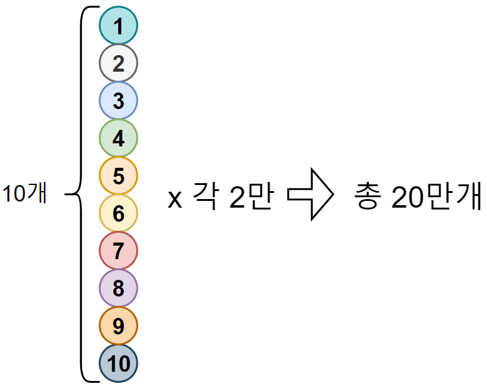
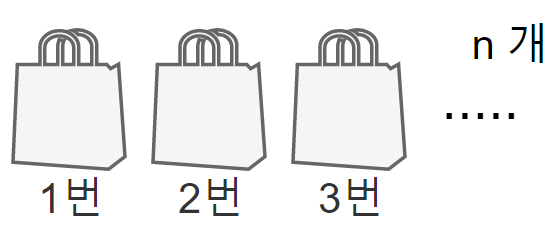
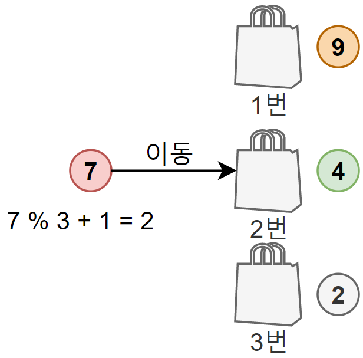

## 개요

`공을 분류하고 검증하는 과정`를 빠르게 수행하기 위한 방법을 찾는 과제

---

## 사전 조건


총 10개의 **1부터 10까지의 공이 존재**한다.




**각 공은 2만개씩** 있으며 **총 20만개의 공**이 있다.
해당 **공의 모든 숫자를 더하면 1,100,000(110만)** 이다.

---

## 목표

지금부터 가방이 n개가 존재한다고 가정한다.



여기서 가방은 각자의 고유의 번호(index)가 있으며 가방의 순서대로 순차적인 번호이다.
목표는 모든 공을 가방에 분류하여 담는 것이며 이때 다음과 같은 규칙을 따른다.

- 공에 부여된 숫자를 s라 하고 가방이 n개가 있을 경우, 공은 `s % n + 1`의 결과로 나온 값의 가방에 담는다.
  - 여기서 `%`는 나머지를 구하는 기호, 예시로 `2 % 3 = 2` 이다.

아래의 예시를 보도록 한다.



전체 가방이 3개가 있고 여기서 7번 공을 적절한 가방에 담으려고 한다.
여기서 적절한 가방을 찾는 공식에 의해 `7 % 3 + 1 = 2`를 도출할 수 있다.
이렇게 도출한 2에 대응하는 2번 가방에 담는다.

---

## 테스트를 위한 클래스 작성

목표를 달성하기 위해 간단한 클래스를 작성해보자.

#### 공(Ball)

```java
// 공 클래스
// 내부적으로 공이 갖고 있어야할 번호가 있음
public class Ball {
  private final int number;

  public Ball(int number) {
    this.number = number;
  }

  public int getNumber() {
    return number;
  }
}
```

#### 공들이 흩어져있는 그라운드(LitteredBallGround)

```java
// 공들이 흩어져있는 그라운드
// 모든 공을 갖고 있으며 공을 반환하는 책임을 갖고 있음
public class LitteredBallGround {
  private final Queue<Ball> balls;
  private final int size;

  LitteredBallGround(Queue<Ball> balls) {
    this.balls = balls;
    this.size = balls.size();
  }

  // 공을 반환하고 삭제
  public Ball getBall() {
    return balls.poll();
  }
}
```

#### `공들이 흩어져있는 그라운드(LitteredBallGround)` 생성기
```java
public class LitteredBallGroundGenerator {
    private final static int size = 10000000;

    public static LitteredBallGround generate() {
        return new LitteredBallGround(getBalls());
    }

    private static Queue<Ball> getBalls() {
        Queue<Ball> balls = new ConcurrentLinkedQueue<>();
        for (int seq = 0; seq < size; seq++) {
            balls.add(new Ball(getBallNumber(seq)));
        }
        return balls;
    }

    private static int getBallNumber(int sequence) {
        return sequence % 10 + 1;
    }
}
```
        

#### 가방(Bag)

```java
// 가방 클래스, 
// 공을 분류 후에 담을 수 있음
public class Bag {
  private final List<Ball> balls = new ArrayList<>();

  public void addBall(Ball ball) {
    balls.add(ball);
  }

}
```


}